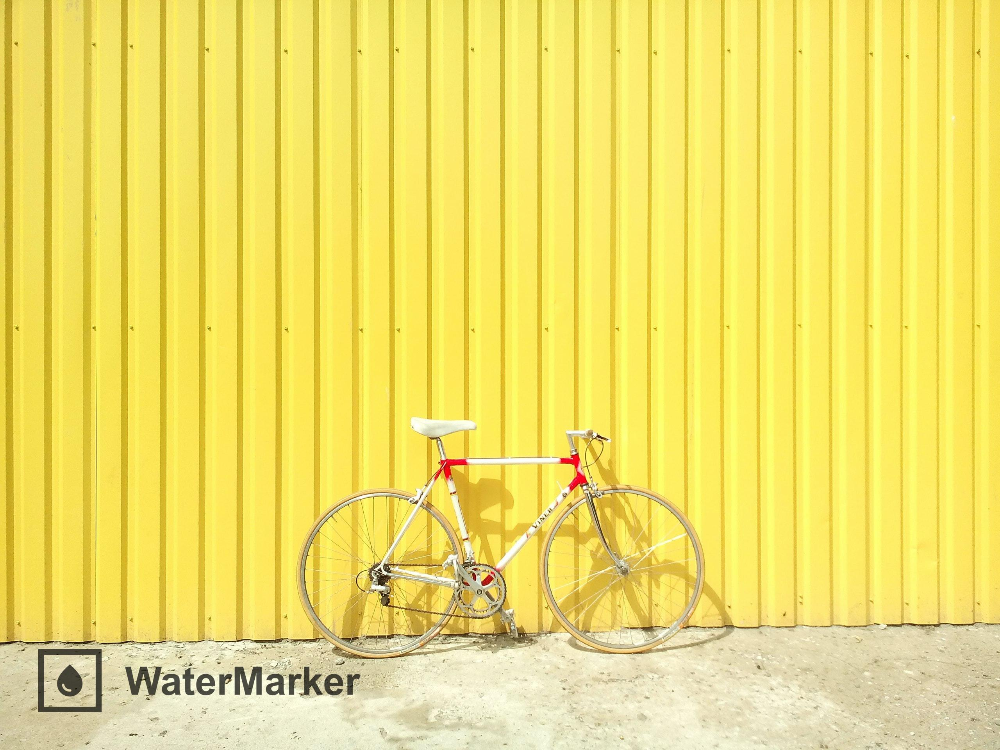

# [WaterMarker](https://nico.ismaili.de/) &middot; [](https://github.com/ismailinico/watermarker/blob/main/LICENSE)


A [Python 3.10](https://www.python.org/downloads/) program which autonomizes the application of watermarks to a specified set of images. Apart from **automatic watermarking**, it also supports **auto watermark color inversion** and **auto watermark scaling**.

This software was developed by [Nico Ismaili](https://nico.ismaili.de/) with the primary purpose of facilitating the selling of [photographs](https://nico.ismaili.de/).

## Prerequisites

To be able to run the program and install the required dependencies you will need to have [Python 3.10](https://www.python.org/downloads/) and [pipenv](https://pipenv.pypa.io/en/latest/) installed.

## Getting Started

Clone the repository, navigate to the project folder and run `pipenv install` to install all required dependencies.

Then run [watermarker.py](./src/watermarker.py) by using the following command:

```cmd
python watermarker.py
```

Afterwards, a folder named [unmarked](resource/unmarked/) should open, in which unmarked images can be placed. Also in this folder is the [marked](resource/unmarked/marked/) directory, in which marked images will appear.

To change the paths to both folders, as well as the watermark image, please refer to the next chapter.

## Configuration

Access to all configurable parameters of WaterMarker can be obtained by opening the [config.json](config.json) file in any text editor. In the file a variety of values can be fitted to one's specific needs. The name, type, range, default value and explanation of each configurable parameter can be found in the table below.

| Name            | Type                    | Range                                                  | Default Value                | Explanation                                                                                                                                                                                                      |
| --------------- | ----------------------- | ------------------------------------------------------ | ---------------------------- | ---------------------------------------------------------------------------------------------------------------------------------------------------------------------------------------------------------------- |
| unmarkedDirPath | string                  | -                                                      | "./resource/unmarked"        | Path to the folder in which unmarked images will be placed.                                                                                                                                                      |
| markedDirPath   | string                  | -                                                      | "./resource/unmarked/marked" | Path to the folder in which marked images will be stored.                                                                                                                                                        |
| watermarkPath   | string                  | -                                                      | "./resource/watermark"       | Path to the watermark image PNG file. To get the best results color your watermark either compeletely white or black.                                                                                            |
| rel_size        | float                   | 0 to 1                                                 | 0.03                         | Defines the scale of the watermark as a percentage of the total area of the base image.                                                                                                                          |
| padding         | float **or** [int, int] | 0 to 1 **or** [x, y], where x and y are whole numbers. | 0.6                          | Either an int list, from which the [0] defines the horizontal and [1] the vertical padding, or a percentage of the watermark pixel height, which will then be used as padding on both axes.                      |
| pos             | string                  | "TL", "TR", "BL" or "BR"                               | "BL"                         | Defines the where the watermark will be pasted onto the base image. TL = top-left, TR = top-right, BL = bottom-left and BR = bottom-right.                                                                       |
| opacity         | float                   | 0 to 1                                                 | 0.7                          | Defines the opacity of the watermark.                                                                                                                                                                            |  |
| threshold       | int                     | 0 to 255                                               | 150                          | Defines the threshold value of when the algorithm defines an area as bright or dark. **Only change this value if their is an issue with brightness detection.**                                                  |
| rec_watch       | boolean                 | true or false                                          | false                        | Flag which defines if the unmarked folder should be watched recursively, meaning changes in all subfolders will be acted upon. **Set this value to false if your marked folder is inside your unmarked folder.** |

Please restart the program for changes to take effect.

## Usage

## Compatibility

WaterMarker runs on all Python compatible operating systems. If you experience an error on your system, please do not hesitate to [open a new issue](https://github.com/ismailinico/watermarker/issues/new) concerning your problem.

### Image types

As input images the current version of WaterMarker only supports the .jpg image format. Watermark images must be in .png format.

## Examples

In this section two different images, one [bright](./resource/unmarked/bright_og.jpg) and one [dark](./resource/unmarked/dark_og.jpg), are to be marked. Additionally, cropped versions of each image have been provided to showcase the software's automatic relative sizing capabilities.

### Original Images

These are the images which were put inside the [unmarked](resource/unmarked/) directory.

#### No Crop (Unmarked)

[](resource/unmarked/bright_og.jpg)
[](resource/unmarked/dark_og.jpg)

#### Instagram square crop (Unmarked)

[](resource/unmarked/bright_1x1.jpg)
[](unmarked/dark_1x1.jpg)

#### Instagram landscape crop (Unmarked)

[](resource/unmarked/bright_2x1.jpg)
[](unmarked/dark_2x1.jpg)

#### Instagram portrait crop (Unmarked)

[](unmarked/bright_4x5.jpg)
[](unmarked/dark_4x5.jpg)

### Watermarked images

This is what was outputted by WaterMarker into the [marked](resource/unmarked/marked/) directory.

#### No Crop (Marked)

[](resource/unmarked/marked/bright_og_marked.jpg)
[](resource/unmarked/marked/dark_og_marked.jpg)

#### Instagram square crop (Marked)

[](resource/unmarked/marked/bright_1x1_marked.jpg)
[](marked/dark_1x1_marked.jpg)

#### Instagram landscape crop (Marked)

[](resource/unmarked/marked/bright_2x1_marked.jpg)
[](marked/dark_2x1_marked.jpg)

#### Instagram portrait crop (Marked)

[](marked/bright_4x5_marked.jpg)
[](marked/dark_4x5_marked.jpg)

## Credits

The [bright sample photo](resource/unmarked/bright_og.jpg) was created by [Alexey Lin](https://unsplash.com/@alex_lin?utm_source=unsplash&utm_medium=referral&utm_content=creditCopyText).

The [dark sample photo](resource/unmarked/dark_og.jpg) was created by [Osman Rana](https://unsplash.com/@osmanrana?utm_source=unsplash&utm_medium=referral&utm_content=creditCopyText).
  